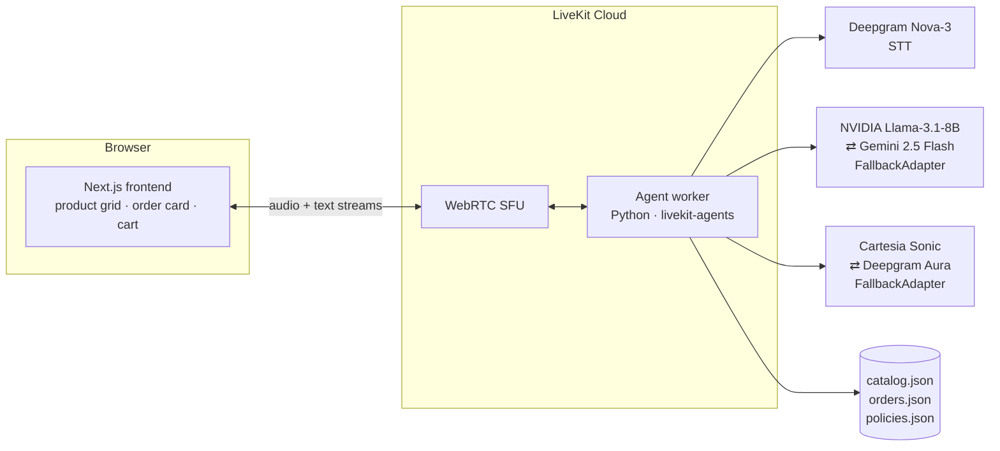

# ShopMax — a grounded, low-latency e-commerce voice agent

A voice-first storefront: speak to **Max**, and it searches a real product
catalog, checks stock and prices, tracks orders behind an identity gate, and
answers policy questions — **strictly grounded**, with a live product UI that
stays in sync with what the agent says.

Built on **LiveKit Agents** (WebRTC), deployed to **LiveKit Cloud**.

## What it does

| Capability | Tool | Grounding |
|---|---|---|
| Product search | `product_search` | Fuzzy retrieval (`rapidfuzz`) over a 25-product catalog; absent products return *nothing* |
| Stock, price, variants | `stock_and_price_check` | Real JSON values; prices returned pre-formatted in spoken words (`num2words`, en-IN) |
| Order tracking | `order_status_lookup` | **Identity-gated** — requires a matching customer name before revealing anything |
| Store policies | `policy_lookup` | 10-topic policy KB; off-topic questions are declined, not improvised |
| Voice-aware cart | `view_cart` | The web UI streams cart state to the agent, so "what's my total?" is answered by voice |

## Architecture



**Voice ↔ visual loop.** The agent publishes results over LiveKit **text
streams** (`shopmax.products`, `shopmax.order`, `shopmax.cart`): search results
render as a product grid, verified orders as a status-stepper card, and the
UI pushes cart state back so the agent can answer cart questions aloud.
Empty search results are published too, so the panel shows a designed
no-results state instead of silently drifting out of sync with the voice.

**Failover everywhere.** Both the LLM and the TTS run behind a
`FallbackAdapter`, so a provider quota blip degrades a turn instead of killing
it. The LLM pairs NVIDIA's `meta/llama-3.1-8b-instruct` (default primary,
~481 ms TTFT) with Gemini 2.5 Flash — `LLM_PRIMARY=gemini` prefers Gemini
quality on days its free quota allows. The TTS pairs Cartesia Sonic with
Deepgram Aura; `TTS_PROVIDER=deepgram` runs Aura alone when Cartesia has no
credits (avoiding a per-utterance failed handshake that audibly glitches the
audio). Optional per-step routing sends tool-decision turns to the fast/cheap
model and user-facing replies to the higher-quality one.

## Measured latency

Automated mic-free benchmark ([bench/latency_bench.py](bench/latency_bench.py)):
synthesizes 10 spoken queries with TTS, publishes them into a live room, and
parses medians from the agent's own instrumentation.

| Metric | Target | Observed (median) | |
|---|---|---|---|
| LLM time-to-first-token | < 600 ms | **481 ms** | ✅ |
| TTS time-to-first-byte | — | **184 ms** | ✅ |
| End-to-end turn | < 1.2 s | **1.66 s** | ⚠ inside the < 1.8 s acceptable band |

The E2E gap is structural, not a regression: a tool-using turn makes **two**
sequential LLM round-trips (choose tool → run it → formulate reply) plus STT
endpointing. Non-tool turns hit ~1.0 s.

## Evals caught real bugs

The test suite (62 passing: 50 network-free unit + 12 live-LLM evals) combines
deterministic tool/value assertions with LLM judges for hallucination,
off-topic refusal, and multi-turn grounding — plus a regression test for every
bug found by driving the deployed stack (dictated order IDs, invented category
filters, plural-vs-singular policy queries, TTS provider selection, and more).
Two bugs the evals caught:

1. **The "gaming laptops" hallucination.** Naive substring search returned a
   USB-C charger + a gaming keyboard for "gaming laptops", which the LLM then
   misrepresented as laptops. Tracked as a strict `xfail`, fixed by fuzzy
   retrieval with min-token coverage — the eval is now a normal pass.
2. **Silent failover masking a dead primary.** The first live end-to-end run
   revealed every Gemini call failing with 400 `INVALID_ARGUMENT` (Google began
   rejecting request deadlines under 10 s; the fallback adapter's 5 s default
   became the request deadline). The turn always survived via fallback — which
   is exactly why only live verification caught it.

## Run it

**Backend** (Linux/WSL2 — native deps for Silero VAD + turn detection):

```bash
python -m venv venv && source venv/bin/activate
pip install -r requirements.txt
cp .env.example .env        # fill in LiveKit / Deepgram / Cartesia / Gemini keys
python -m livekit.agents download-files
python agent.py dev         # or `console` for a local mic test
```

**Frontend**:

```bash
cd frontend
pnpm install
pnpm dev                    # http://localhost:3000
```

Connect, then say **"show me headphones"** — the grid slides in.

**Tests**: `pytest -m "not llm"` (fast, no keys) or `pytest` (full, hits live LLMs).

**Deploy**: `lk agent create .` builds the included [Dockerfile](Dockerfile)
remotely and runs the agent on LiveKit Cloud — the frontend then needs nothing
local but a token endpoint.

## Stack

| | Choice | Why |
|---|---|---|
| Transport | LiveKit Cloud (WebRTC SFU + Agents) | Low-latency audio + text streams out of the box |
| STT | Deepgram Nova-3 | Lower streaming latency than Whisper |
| LLM | NVIDIA Llama-3.1-8B ⇄ Gemini 2.5 Flash (`LLM_PRIMARY`) | Fast default primary (~481 ms TTFT), quality alternative, automatic failover |
| TTS | Cartesia Sonic ⇄ Deepgram Aura (`TTS_PROVIDER`) | Natural inflection primary, automatic failover; Aura-only mode when Cartesia is out of credits |
| Turn detection | Silero VAD + LiveKit TurnDetector | Audio + semantic end-of-turn |
| Frontend | Next.js 15 / React 19 + Motion | State-driven UI (idle → listening → thinking → speaking) |
| Data | JSON (catalog / orders / policies) | Zero-overhead, inspectable, easy to seed |
